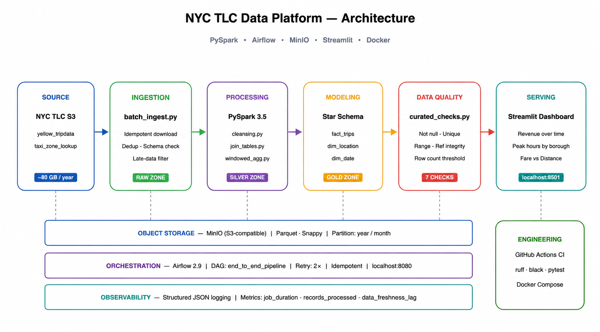

# Design Document — NYC TLC Data Platform

## 1. Problem Statement

Build a compact end-to-end data platform that ingests NYC Yellow Taxi trip data,
transforms it through an engineering-grade pipeline, and serves analytical insights
through a dashboard.

Dataset: NYC TLC Yellow Taxi Trip Records, 2023 (Q1).
Size: ~4GB compressed Parquet, ~37 million records across 3 months.
Source: AWS S3 public bucket (d37ci6vzurychx.cloudfront.net).

## 2. Architecture



```
[NYC TLC S3] --> [Ingestion] --> [MinIO Raw Zone]
                                      |
                               [PySpark Cleansing]
                                      |
                               [MinIO Silver Zone]
                                      |
                        [PySpark Join + Aggregation]
                                      |
                          [MinIO Gold Zone (Star Schema)]
                                      |
                     [Airflow DAG orchestrates all steps]
                                      |
                            [Streamlit Dashboard]
```

## 3. Tech Stack Decisions

| Component | Choice | Reason |
|-----------|--------|--------|
| Distributed Engine | PySpark 3.5 | Industry standard, scales beyond single node, strong SQL + DataFrame API |
| Object Storage | MinIO | S3-compatible, runs locally via Docker, zero cloud cost |
| File Format | Parquet (Snappy) | Columnar, compressed, widely supported |
| Orchestration | Airflow 2.9 | DAG-based, strong retry/observability, familiar to industry |
| Dashboard | Streamlit | Fast to build, Python-native, suitable for data apps |
| DQ Framework | Custom checks + Great Expectations | Lightweight, no extra infra needed |

## 4. Data Model

### Grain

`fact_trips`: one row per completed taxi trip.
Primary key: `trip_id` (SHA-256 of VendorID + pickup_datetime + PULocationID).

### Star Schema

```
dim_date          dim_location
   |                   |
   +---> fact_trips <--+
```

**fact_trips** columns: trip_id, pickup_date_sk, pickup_location_sk, dropoff_location_sk,
VendorID, tpep_pickup_datetime, tpep_dropoff_datetime, passenger_count, trip_distance,
trip_duration_minutes, fare_amount, tip_amount, tolls_amount, total_amount, pickup_hour, year, month.

**dim_location** grain: one row per taxi zone (265 zones total).

**dim_date** grain: one row per calendar day.

## 5. Partition Strategy

- Raw zone: partitioned by `year=/month=` matching source filename structure.
- Silver zone: partitioned by `year=/month=` after cleansing.
- Gold fact_trips: partitioned by `month` for query pruning on time-range filters.
- Gold aggregations: partitioned by `pickup_date`.

Justification: analysts most commonly query by month or date range. Partition pruning
reduces data scanned by ~10x for monthly queries.

## 6. Failure Modes Handled

- Duplicate records: dedup on (VendorID, pickup_datetime, dropoff_datetime).
- Schema violations: null required columns are quarantined, not dropped silently.
- Late-arriving data: records outside the expected month window are filtered and logged.

## 7. Trade-offs

- Single Spark master (no HA): acceptable for 1-week scope, would use YARN/K8s in production.
- No incremental load: full overwrite per partition. Simpler to reason about; Delta Lake
  merge would be the next step for production.
- Streamlit vs Superset: Streamlit is faster to build and easier to version-control.
  Superset has richer BI features but requires more setup time.

## 8. What I Would Do With More Time

- Add Delta Lake for ACID upserts and time-travel.
- Add dbt for SQL-based transformations with lineage.
- Deploy on cloud (GCS + Dataproc) with Terraform.
- Add real-time ingestion path via Kafka + Flink.
